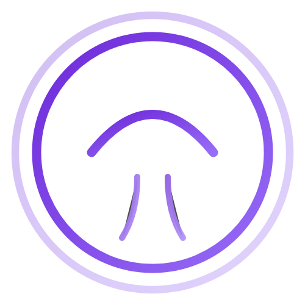

MauiMotion
==========

**The animation engine for .NET MAUI.**

  

* * *

**MauiMotion** is a high-performance, declarative animation library for .NET MAUI. It allows you to create complex entrance animations, staggered lists, and micro-interactions entirely in XAML.

Installation
---------------

    dotnet add package Plugin.MauiMotion

Setup
--------

### 1\. Register the Service

Go to your `MauiProgram.cs` file and add `.UseMauiMotion()` to the builder.

    using MauiMotion; // Add this using
    
    public static MauiApp CreateMauiApp()
    {
        var builder = MauiApp.CreateBuilder();
        builder
            .UseMauiApp<App>()
            .UseMauiMotion() // <--- Add this line
            .ConfigureFonts(fonts =>
            {
                fonts.AddFont("OpenSans-Regular.ttf", "OpenSansRegular");
            });
    
        return builder.Build();
    }

### 2\. Add XAML Namespace

Open your `ContentPage` or `App.xaml` and add the namespace:

    <ContentPage xmlns="http://schemas.microsoft.com/dotnet/2021/maui"
                 xmlns:x="http://schemas.microsoft.com/winfx/2009/xaml"
                 xmlns:mm="http://mauimotion.com"
                 x:Class="MyApp.MainPage">

Quick Start
--------------

### Basic Entrance

Animate any view by simply setting the `Animation` property.

    <Border BackgroundColor="#512BD4"
            Padding="20"
            mm:Motion.Animation="SlideInBottom"
            mm:Motion.Duration="800">
        
        <Label Text="Hello, Motion!" TextColor="White" />
        
    </Border>

### Waterfall List (Staggered)

Use the `EntranceBehavior` inside a `CollectionView` to create staggered loading effects.

    <CollectionView ItemsSource="{Binding Items}">
        <CollectionView.ItemTemplate>
            <DataTemplate>
                 <Border>
                    <Border.Behaviors>
                        <!-- Staggers each item by 100ms -->
                        <mm:EntranceBehavior Animation="FadeIn" Duration="600" Stagger="100" />
                    </Border.Behaviors>
                    <Label Text="{Binding .}" />
                 </Border>
            </DataTemplate>
        </CollectionView.ItemTemplate>
    </CollectionView>

### Interactive Buttons

Trigger animations on user interactions (Tap/Click).

    <Button Text="Shake Me">
        <Button.Behaviors>
            <mm:MotionBehavior EventName="Clicked" Animation="Shake" />
        </Button.Behaviors>
    </Button>

Documentation
----------------

*   [**Animation Reference**](docs/ANIMATIONS.md) - See the full list of available animations (Fade, Shake, Flip, etc). Learn about Skeletons, Infinite Loops, and Custom Animations.

Contributing
---------------

We welcome contributions! Whether it's a bug fix, new animation type, or documentation improvement.

* See our **[Contributing Guide](docs/CONTRIBUTING.md)** for instructions on how to set up the dev environment.
* Open an [Issue](https://github.com/pallav1111/MauiMotion/issues) to discuss new features.

* * *

MauiMotion is licensed under the [MIT License](LICENSE).